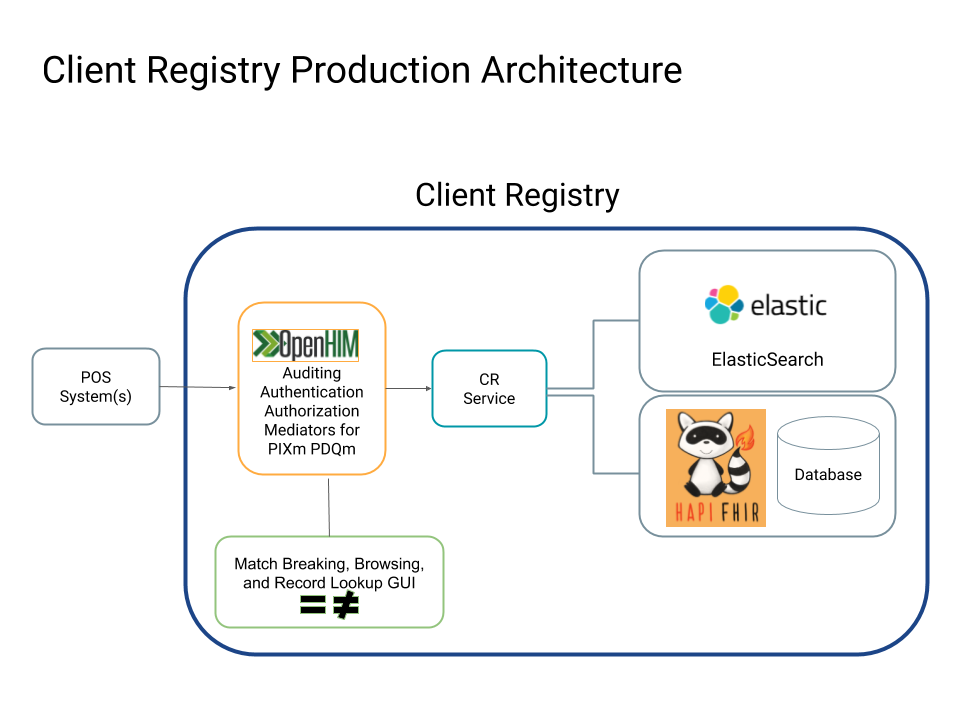
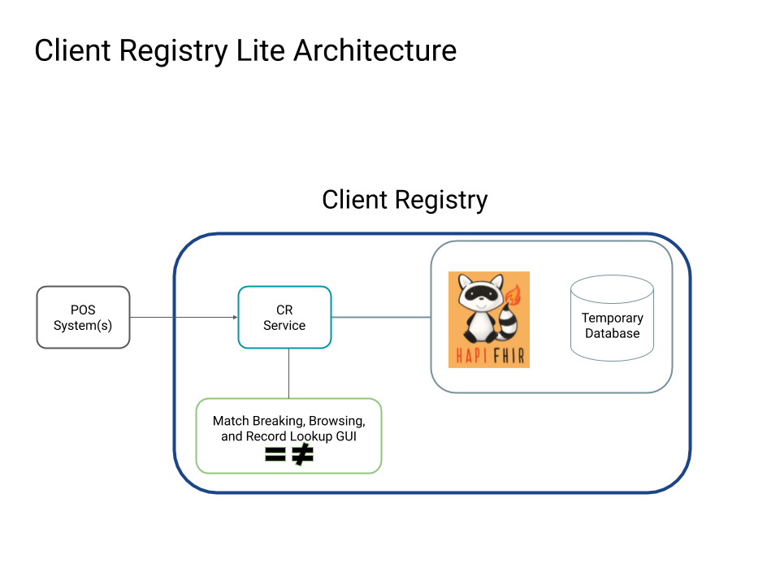

# Architecture

OpenCR is not one application, instead it's a set of applications that work together in the [Open Health Information Exchange (OpenHIE)](http://ohie.org) architecture to serve point-of-service systems, like EMRs, insurance mechanisms, and labs.

!!! note
    This is not an OpenHIE product. OpenHIE does not produce software products, rather it produces an architecture specification and is composed of a large, global community of practice around standards-based health information exchanges, particularly in low resource settings. Please [join us](https://ohie.org)!

The OpenCR architecture is made up of both a lite and a production version. In the production version it includes:

* The [**Open Health Information Mediator (OpenHIM)**](http://openhim.org): The OpenHIM is the entrypoint for POS systems, and includes authentication (are you who you say you are?), authorization (what roles do you have permission to fulfill?), and auditing of all transactions.
* The [**HAPI FHIR Server**](http://hapifhir.io): HAPI is the reference FHIR server in Java and scalable into production environments.
* The [**ElasticSearch**](http://elastic.co/products/elasticsearch): Elasticsearch is a powerful search engine that is highly performant.
* An **optional UI** to view and break matches between records, and to select and chain together decision rules around matching algorithms.

The lite architecture is for non-production and does not require OpenHIM.

