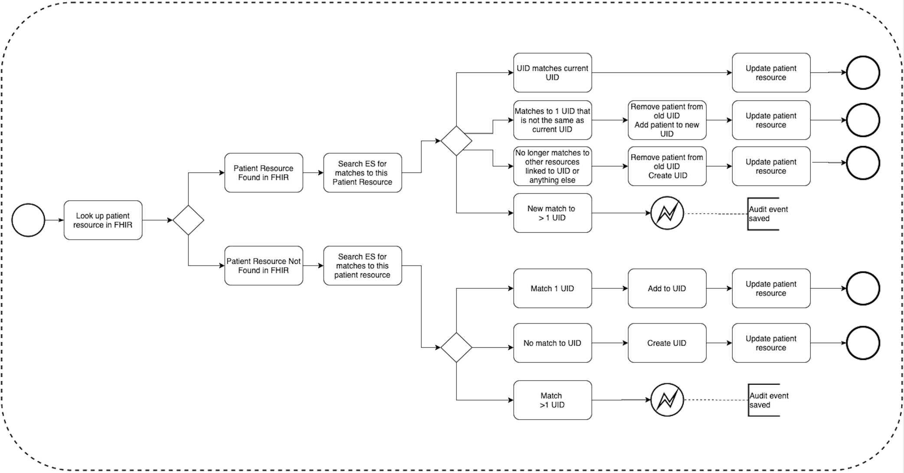

# Record linkage process

The below diagram shows how OpenCR performs matching and record linkage. The diagram begins with a source system submitting a request with patient demographic data in a FHIR message, as indicated by the circle on the left.

After requests are submitted with demographic data, OpenCR reads the submitting system's ID of that patient. The Client Registry searches for that source system's ID in its records. This happens regardless if it is a new patient or update of existing patient.

When the submitting system's ID matches an existing record, the Client Registry updates the patient demographic information of that record with changes submitted. Once the update is complete, the existing record linkages may affected. This is because algorithms may not continue to link records as before because details have changed. Therefore, the Client Registry will pool all patients that were previously matched and break all the matches. The Client Registry will rerun matching algorithms again to see what matches are currently true matches of the patient. Then the Client Registry will be updated with the true matches given the changes in demographic data.

Another scenario is when the Client Registry searches and doesn't find anyone already with same submitting system's ID.
If there is not existing match, the Client Registry runs the matching algorithms for existing patients who matches that patient and will provide record linkages with other records.

## Requirements

In order for this process to work as expected, there are some requirements:

* Requests sent to the Client Registry must be made of FHIR messages. FHIR is a popular specification for accessing an API for providing data in health systems. Messages must support FHIR R4.
* Requests can only be received from trusted systems. See the [security page](../dev/security.md) in the Developers Manual for mode detail.