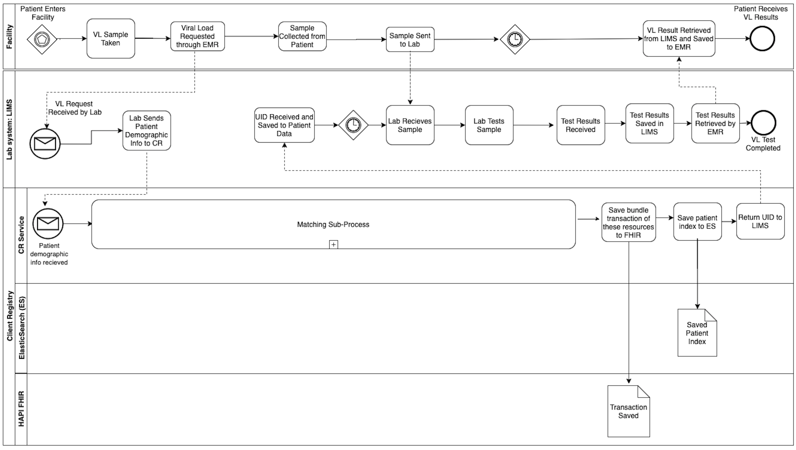
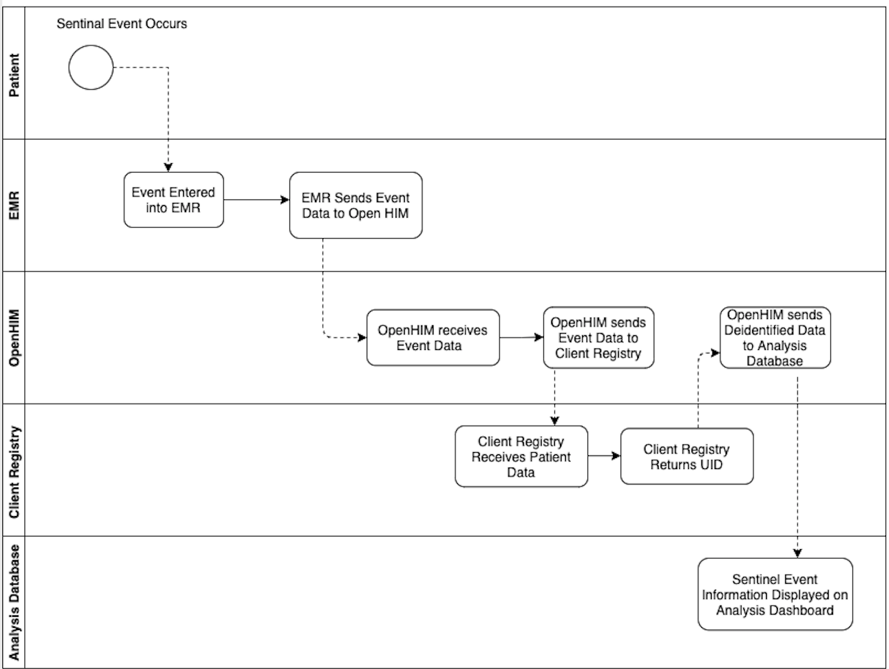

# Workflows

Several workflows are supported out-of-the-box depending on the POS-Client Registry use case.

### Viral Load Test Request (Paper)

A plasma specimen is received by a laboratory for HIV viral load testing. Demographic data and requesting location data is entered into the LMIS. The LMIS queries the Client Registry for a UID. The Client Registry provides the UID if one did not exist and stores limited patient demographic information but **does not** store test results. A use that this enables (but the Client Registry **does not** provide) is the ability to track persons lab results over time.

### Viral Load Test Request (EMR)

A patient is registered at a clinic. The clinician recommends an HIV viral load test. The plasma specimen is sent for processing to the laboratory. The Client Registry receives the UID and specimen and returns a diagnostic result that is then stored in the EMR. 

### Case-Based Surveillance

A patient is registered at a clinic and has been assigned a UID. In the course of their clinical encounter, a sentinel event occurs, triggering the EMR to send limited clinical information to the Health Information Exchange (HIE). The HIE sends the data to a data analysis warehouse for population analysis and case-based surveillance.
